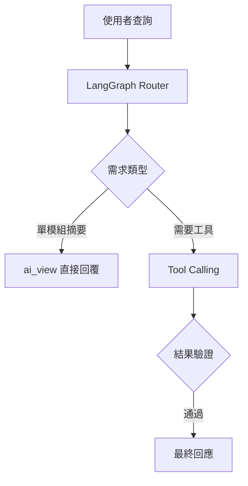

## 我的 ERP AI 分層架構

這裡直接寫代碼塊，組件會自動攔截：

```mermaid
flowchart TD
    A[使用者查詢] --> B[LangGraph Router]
    B --> C{需求類型}
    C -->|單模組摘要| D[ai_view 直接回覆]
    C -->|需要工具| E[Tool Calling]
    E --> G{結果驗證}
    G -->|通過| H[最終回應]
```
