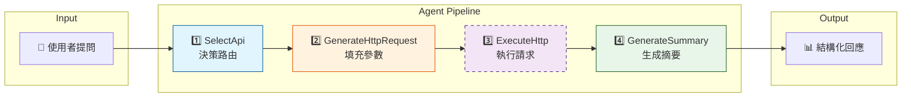
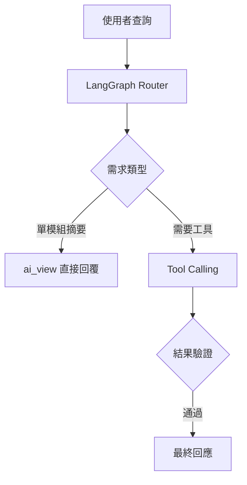

**大模型不一定更好，適合的配置才是關鍵。**

在最近的本地 LLM 專案中，透過系統性的基準測試（6 組配置 × 13 個案例），成功將 Pipeline 的任務成功率由 53.8% 大幅提升至 92.3%。

過程中我發現一個極具價值的反直覺現象：

> 🚨 **120B 模型 + High Reasoning 配置，在結構化輸出任務上反而會產生「API 名稱幻覺」，成功率只有 53.8%。**

這篇文章記錄了從數據分析到參數調優的完整過程，希望能為正在落地本地 LLM 的開發者提供一些實質參考。

## 從 NL2SQL 的困境說起

在做這個專案之前，我在另一個產品中大量使用 **NL2SQL**—讓模型直接讀 DB Schema，把使用者的自然語言問題轉成 SQL 查詢。

聽起來很優雅，掉進了一個充滿 **Token 消耗、延遲、與維護地獄** 的泥沼：

| 痛點              | 現象                                | 影響                                                  |
| --------------- | --------------------------------- | --------------------------------------------------- |
| **Token 爆炸**    | 每次查詢都要帶上幾千 Token 的 Schema 定義      | **錢在燒、速度慢**（Context Window 永遠不夠用）                   |
| **Prompt 維護地獄** | 想提高準確率就得餵 Few-shot 範例，但業務邏輯一變就要重寫 | **維護成本極高**（最後變成為了特定 Query 量身定做 Prompt，失去了 AI 的泛化意義） |
| **幻覺難防**        | 模型會「創造」不存在的欄位或關聯                  | **信任崩塌**（使用者看到報表有數字，卻不知道那是 AI 亂湊的）                  |
| **RBAC 黑洞**     | 權限控制只能做到連線層，無法管到欄位/列級別            | **資料外洩風險**（無法預測 AI 會不會 JOIN 出敏感欄位）                  |
| **前置作業繁瑣**      | 髒亂的 Schema 要手工補註解，還得適配不同 SQL 方言   | **擴展性差**（每接一個新 DB，就是一場清洗資料的硬仗）                      |

**1. 權限控制（RBAC）的結構性崩壞**:br
這是最讓我在意的問題。傳統資料庫的權限設計是靜態的—我設定誰能讀哪張表。但 LLM 生成 SQL 是動態的，你根本無法預判它這次會 SELECT 哪個敏感欄位，或是意外 JOIN 了哪張不該碰的表。 即便加上 Row-Level Security (RLS) 或 Column Masking，這些機制通常假設「查詢結構是已知的」。NL2SQL 打破了這個假設，讓資安稽核變成一場不可能的任務。

**2. Few-shot 的「準確度悖論」**:br
為了讓 SQL 寫對，我們一開始嘗試用 Few-shot Prompting（提供範例給模型參考）。這確實有效，但代價慘重。 簡單的查詢還好，一旦涉及複雜的業務邏輯（例如：「計算扣除全勤獎金後的實發薪資」），兩三個範例根本不夠覆蓋邊界情況。結果 Prompt 越寫越長，Token 越吃越多，最後我們發現自己根本不是在寫 Prompt，而是在用自然語言 Hard-code 業務邏輯。只要業務規則一改，Prompt 就要整組重測，這完全違背了使用 AI 提效的初衷。

**3. 隱形的適配成本**:br
另一個被嚴重低估的是「髒活」。真實世界的 DB Schema 往往殘破不堪，欄位叫 `col_a1` 這種事司空見慣。為了讓模型看懂，我們得人工補上大量 Description。更別提 SQL 方言的災難—MySQL 的 `LIMIT`、Oracle 的 `ROWNUM`、PostgreSQL 的 `OFFSET`，每換一個底層資料庫，Prompt 和驗證邏輯就得重寫一輪。

**這些教訓讓我認清了一個事實：讓 LLM 直接寫 SQL，是在用戰術上的勤奮（寫 Prompt），掩蓋戰略上的懶惰（架構設計）。**

這就是為什麼在這個專案中，我決定換一條路：**不讓模型直接碰 SQL，改用結構化的 Agent Pipeline。**

## Pipeline設計：將「魔法」拆解為可控的工序

既然 NL2SQL 的「一步到位」是災難，解決方案就是 **「退一步海闊天空」**。

我不讓 LLM 直接去碰最底層的資料，而是模仿人類工程師的行為模式，將原本黑盒子的思考過程，強制拆解為四個職責單一（Single Responsibility）、且可被單獨測試的流水線步驟：



這不僅僅是把大任務切小，而是為每一步設下停損點：

| 步驟                      | 核心職責                       | 任務屬性        | 失誤代價與風險                                               |
| ----------------------- | -------------------------- | ----------- | ----------------------------------------------------- |
| **SelectApi**           | 理解意圖，從工具箱挑出對的工具            | 分類 / 匹配     | **後續全錯**:br 選錯 API，後面參數填得再對也是白搭。                      |
| **GenerateHttpRequest** | 根據 spec 填充路徑參數             | 結構化生成       | **查無資料 / 查錯**:br 這是最容易產生幻覺的環節（例如把 page 填成 pageIndex）。 |
| **ExecuteHttp**         | 呼叫後端 API，取得真實資料            | ❌ 不經過 LLM   | **Runtime Error**:br 這是唯一「絕對誠實」的步驟，網路不通就是不通，沒權限就是沒權限。 |
| **GenerateSummary**     | 將 API 回傳的 JSON 轉成使用者看得懂的摘要 | 摘要 & 自然語言生成 | **答非所問**:br 如果格式跑掉，前端或 upper layer 可能會解析失敗。           |

**核心思路：讓 LLM 遠離資料庫**

```text
❌ 以前：User → LLM → SQL → Database → LLM → User
✅ 現在：User → LLM → HTTP → Backend API → LLM → User
```

中間多了一層 Backend API，看起來繞了路，但換來三個好處：

| 好處            | 說明                                                                                                     |
| ------------- | ------------------------------------------------------------------------------------------------------ |
| **RBAC 回歸正軌** | 權限控制回到 API Gateway / Backend，LLM 再幻覺，也無法突破 API 層級的權限管控                                                 |
| **錯誤邊界清晰**    | 每一步失敗都有明確的錯誤類型，方便 debug 和 fallback                                                                     |
| **LLM 任務單純化** | 我們不再要求一個模型同時懂「意圖理解」、「SQL 方言」和「資料摘要」。拆解後，每個步驟的 Context Window 需求大幅下降，這也是為什麼我們後續能用 20B 甚至更小的模型來跑通流程的關鍵原因 |

## 我的 ERP AI 分層架構

這裡直接寫代碼塊，組件會自動攔截：


